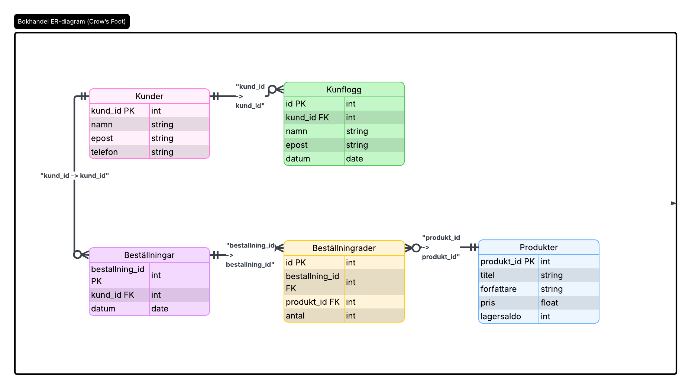

#  Bokhandel – Inlämning 2
**Anton Eriksson (YH25)**

##  Beskrivning
Databasen hanterar kunder, produkter och beställningar i en bokhandel.

Relationer:
- En kund → flera beställningar (1–M)
- En beställning → flera beställningsrader (1–M)
- En produkt → flera beställningsrader (1–M)

##  Tabeller
- **kunder** (kund_id, namn, epost, telefon)
- **produkter** (produkt_id, titel, forfattare, pris, lagersaldo)
- **bestallningar** (bestallning_id, kund_id, datum)
- **bestallningsrader** (id, bestallning_id, produkt_id, antal)
- **kundlogg** (id, kund_id, namn, epost, datum)

##  Funktioner
- SELECT, WHERE, ORDER BY
- UPDATE, DELETE, TRANSACTION + ROLLBACK
- INNER JOIN, LEFT JOIN
- GROUP BY och HAVING

##  Index & Triggers
- Index på `epost`
- CHECK (pris > 0)
- Trigger loggar nya kunder
- Trigger minskar lagersaldo vid beställning
  
## 🗺️ ER-diagram

Databasens ER-diagram illustrerar relationerna mellan tabellerna:




##  Backup & Restore
Backup:
```bash


mysqldump -u root -p --set-gtid-purged=OFF bokhandel > bokhandel_backup.sql

mysql -u root -p bokhandel < "C:\Users\Anton Eriksson\Documents\SQLbackups\bokhandel_backup.sql"
